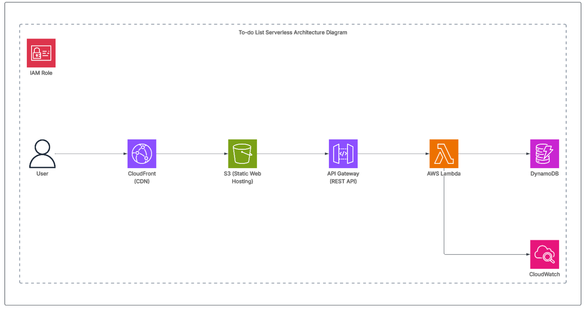

# 📝 To-Do App (Fullstack: ReactJS + AWS)

A simple yet powerful Kanban-style To-Do application built with **ReactJS (frontend)** and **AWS serverless services (backend)**.  
This app supports **full CRUD** operations on tasks and boards, optimized for performance and responsive on all devices.

---

## 🚀 Features

- ✅ Create, Read, Update, Delete (CRUD) for:
  - Boards (projects/workspaces)
  - Tasks (with status updates)
- ✅ Fully responsive UI using **ReactJS**
- ✅ Backend powered by **AWS Lambda**, **API Gateway**, and **DynamoDB**
- ✅ Deployment with **CloudFront** for fast global content delivery
- ✅ Logging and monitoring with **AWS CloudWatch**
- ✅ Environment separation via `.env` variables
- ✅ Optimized for **Core Web Vitals**:
  - LCP: 0.19s ✅
  - CLS: 0 ✅
  - INP: 24ms ✅

---

## 🧱 Tech Stack

| Layer       | Stack                                         |
|-------------|-----------------------------------------------|
| Frontend    | ReactJS, CSS (Responsive Design), Fetch API   |
| Backend     | Node.js (Lambda Functions), Serverless Framework |
| API Gateway | RESTful APIs with CORS configured             |
| Database    | AWS DynamoDB (NoSQL)                          |
| Hosting     | AWS CloudFront + S3 (static frontend)         |
| Monitoring  | AWS CloudWatch                                |
| Auth (planned) | Cognito or JWT-based authentication       |

---

## 📐 Architecture Diagram



---
## ⚙️ Setup & Installation

### 1. Clone the repo
```bash
git clone https://github.com/your-username/to-do-app.git
cd to-do-app
```
### 2. Install dependencies
```bash
cd frontend
npm install

cd ../backend
npm install
```
### 3.Configure environment variables
#### In frontend/.env
REACT_APP_API_BASE=https://your-api-id.execute-api.ap-southeast-1.amazonaws.com/prod
#### In backend/.env or serverless.yml using environment vars
DYNAMO_TABLE_NAME=KanbanApp
AWS_REGION=ap-southeast-1
### 4. Deploy backend (AWS)
```bash
cd backend
sls deploy
```
### 5. Run frontend locally
```bash
cd frontend
npm start
```
### 6. Author
Made by NguyenHoThienThanh - also known as Lamenth
